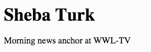

First Website
===

We're gonna go live on GitHub with your very own website!

##Prerequisites

* Students will require a GitHub account and will need to remember their GitHub username and password.
* Students will require a Cloud9 account - they will login to Cloud9 using their GitHub credentials.
* Students should have basic knowledge of HTML and gone through the [Intro to HTML](https://github.com/OperationSpark/javascript-wiki/wiki/HTML-Intro) lesson.

##Overview

###Specs

* At the end of the lesson students will have built and designed their own website that is viewable on the web.
* The website will be hosted on GitHub under their own account, and is something they can build upon on over time. 
* The website will be the student's own and will feature a short profile of the student.

### Take Away

* Basic HTML5, including HTML (content) and CSS (style).
* Basic web page navigation
* Using git and GitHub

### Work Flow

You'll be creating a whole web page from scratch, from creating the `index.html` file, to writing all the `<html>` tags, adding content and style with CSS.  Because you're creating this page from scratch, there will be no TODO's to find in our code in this project.

### Type of App

We are building a website, to be viewed live on the web at your GitHub page, and it will be viewed in a web browser, like Chrome.

##Setup

###Creating a New GitHub Repo For Your Site

First things first, we need to create a new repository on GitHub, named using your GitHub username.

The very awesome GitHub will host a website for each user and organization for free.  The feature is called <a href="https://pages.github.com/" target="_blank">GitHub Pages</a>.

Using this feature is actually really easy.  If you create a repository on GitHub and name it in the pattern of:

    yourusername.github.io
    
...GitHub will host the files of that repo at that URL, provided that repo contains a website.

* We're going to give you the link right here to click to create a new repository on GitHub.

    NOTE: If you're not signed-in to GitHub, you might see a web page that says 404 (This is not the web page you are looking for).  Just sign-in to GitHub on this page and you will be forward to the _create new repository_ page.
    
    Follow these steps and see the screen shot to create a new repository:
    
    <a href="https://github.com/new" target="_blank">Click here to open a new browser tab and create create a new repository</a>.
    
<ol style="list-style-type: upper-alpha;">
    <li>On the Create New Repository page, in the box for **Repository name**, name the repository like `your-github-username.github.io`, replacing `your-github-username` with you actual GitHub username.  MAKE SURE your username is spelled correctly, otherwise you'll have problems (See A).</li>
    <li>Enter a description for your repository in the **Description** box, like `My own awesome website!' (See B).</li>
    <li>Select the Public radio button to allow anyone to see this repository (See C).</li>
    <li>Check the "Initialize this repository with a README" box (See D).</li>
    <li>Click the "Add .gitignore" button, and select "Yeoman" from the dropdown.  Here, we're just selecting Yeoman because it gives us some default ignore patterns... we'll explain later (See E).</li>
    <li>Click "Create Repository" (See F).</li>
</ol>


    Awesome, you created your repository!

2.  Next step, we need to _clone_ our repository into our Cloud9 workspace, where we will do our work.  After creating the repository, you'll be brought to the repository's default view.  In the bottom right corner of the screen, you will want to:
    
    A) Select SSH by clicking the blue text, SSH (See A).
    
    B) Click the "Copy URL to clipboard" button (See B).
    
    

###Creating a New Cloud9 Workspace For Your Site

Nice, you've copied the required URL to clone your repository into Cloud9, which is what we're gonna do next.

1. If you do not have Cloud9 open, open it now in a new browser tab and from your Cloud9 Dashboard, find in the upper left corner and click the green button, "Create New Workspace" > "Clone From URL":

    

2. In the dialogue that pops up: "Source URL" form input, copy and paste in the URL you copied from step 2 (it should still be on your clipboard).
    
    Then, in the environment selection box, select "HTML5" (see B).  Finally, click the green button "Create" (see C).
    
    

3. Wait for the workspace to finish starting (while starting up, you'll see a spinning gear on the newly created workspace in the sidebar), and once the workspace is completed, click the green button, "START EDITING".

    

When the workspace loads, you'll see something like this:


Awesome, we're ready to create our website!

##Lesson Steps

### TODO 1 : Create index.html

Right-click in the file system and select `New File`


Name the file, `index.html`, (press return after naming it to save the new name) like so:


Next, double click the `index.html` file to open it so we can begin editing the file, like so:


Ok great!  We've created our `index.html` file and opened it in the text editor to start devleoping our website!

### An Important Note on HTML Tags

Remember that most HTML tags have both an opening and closing tag.  So, when you create a `<div>` tag, you must also create its closing tag, like so:

```HTML
<div>
    <!-- All other tags and content in here belong to the <div></div> tag -->
</div>
```

Some HTML tags, like the `` tag, do not require a closing tag, because they are not designed to hold content between the opening and closing tag.  The image tag specifies the source of the image it should display using what's called a tag _attribute_, which is a property of the tag, not content of the tag.  Check it out:

```HTML

```

Notice, above, that the `src` attribute is located _inside_ the `` tag.

### TODO 2 : Add the DOCTYPE

You need to tell the browser you're writing an HTML page by adding the following at the top:

````HTML
<!DOCTYPE html>
````
### TODO 3 : Add HTML Tags Requied For a Webpage

By now, you should be familiar with the basic tags needed for the structure of an HTML5 page.  Let's add our `<html>` tags with `<head>` tags and `<body>` tags nested within. 

Like this: 

````HTML
<!DOCTYPE HTML>
<html>
    <head>
    </head>
    
    <body>
    </body>
</html>
````

We made the structure of the site so now we need some content! Give your site a title.

### TODO 4 : Add a Title

You should remember from our previous lessons on HTML5 that you create a title with the `<title>` tag inside of the `<head>`. 

````
<title>Sheba's Amazing Website</title>
````

### TODO 5 : Create Areas for the Menu and Main Content

**Please note:** All of the tags used to mark our HTML content will reside _between_ the opening and closing of the `<body>` tag.  So for rest of the HTML tags you create, _make sure_ you place them _between_:

```HTML
<body>
    <!-- YOUR HTML TAGS GO HERE  -->
</body>
```

We're going to create use `<div>` tags to group our content together.  The `<div>` tag stand for _document divisions_, and they are special tags that help us divide or group together content on our web page.  You can consider them sort of like containers, into which we group content, and they can be invisible or _styled_ with visible properties, like a background color, a border, etc.

So, to start grouping together our content in a meaningful way, inside the `<body>` tag, create a new div using the `<div>` tag.  This is going to contain all the site contents so let's annotate it as such by settings its _class_ attribute to `class="all-contents"`.  Attributes are properties that tell us something more specialized about the tag, and you'll come to understand how these work as you work more with HTML.

Ok, inside our _all-contents_ div, we're going to put the site navigation menu and the main content of our site, so while we're at it, let's also create opening and closing tags for `<nav>` and `<main>`.

Like this:

```HTML
<div class="all-contents">
    <nav>
    </nav>
    
    <main>
    </main>
</div>
```

### TODO 6: Create Structure for our Content

Inside the `<main>` element, create two new `<div>` elements. These will act as the two columns of our page - the sidebar and the main content, as noted by the class we give each:

```HTML
<main>
    <div class="sidebar">
    </div>
    
    <div class="content">
    </div>
</main>
```

### TODO 7 : Add Content

Add the following tags inside of the 'content' div:

* Create a `<header>` element and put your name inside of it.
* Below that make a `<p>` element and inside it put your position or job title such as "Student at XYZ High."
* Save your work and click *Preview > Live Preview File* at the top to view it.

It should look something like this:



#### Image and List 

* Inside of the `<div class="sidebar">` tag, add an `` tag. More on image tags [here](http://www.w3schools.com/tags/tag_img.asp).
* We need to add the URL of an actual image with the **src** attribute. Find an image you would like on your page, you can find an image of yourself from facebook, or anything else using google image search. Right-click on the image, and choose 'Copy Image URL.'
* Paste that URL into the **src** attribute. 

Like this:

```
<div class="sidebar">
    
</div>
```

Save your page and preview it. You should see the image now. If you don't, go back and double check that there are no
errors in your `` tag.

### TODO 8: Add More Content - Interests

Let's create a section for your interests below the `<p>` tag (inside of the '[class=content]' div) with a list.

* Create a section element with a `class="interests"`
* Give the list a title with the `<header>` tag and called it 'Interests'
* Below that create an unordered list with the `<ul>` tag and three sets of `<li>` tags nested inside

```HTML
<section class="interests">
    <header>Interests</header>
    <ul>
        <li>Thing 1</li>
        <li>Thing 2</li>
        <li>Thing 3</li>
    </ul>
</section>
```

Use your own interests! Save and view your changes.

Should look something like this:


### TODO 9 : Navigation and Site Title

We're going to make a menu. Linking to other pages forms the foundation of the web. Early on, the web was nothing but a bunch of HTML pages linked to one another. That's still true today although there's a lot more going on as well. We're going to link to a portfolio page and create it in the next lesson.

* Inside of the `<nav>` tag we created earlier create an unordered list using the `<ul>` tag. Inside it create two `<li>` tags to contain your list items
* Create a link inside of each list item using the `<a>` tag. 
* Finally give each menu item a name by inserting Home and Portfolio between the opening and closing tags.  See the example below.

````HTML
<nav>
    <ul>
        <li><a href="index.html">Home</a></li>
        <li><a href="portfolio.html">Portfolio</a></li>
    </ul>
</nav>
````

Save and view your work. You now have some menu items! The *Home* link even works since it simply links to the page we are currently working on. The other link is for our portfolio page which we'll build out in the next lesson.

Your site needs a title! Inside of the `<nav>` before the `<ul>` tag add an `<header>` and type your site's title in there.

Like this:

```HTML
<nav>
    <header>Sheba's Glorious Website</header>
    <ul>
        <li><a href="index.html">Home</a></li>
        <li><a href="portfolio.html">Portfolio</a></li>
    </ul>
</nav>
```

Save and view your work. You should see your title inside of the navbar to the left. 

### TODO 10: Make it Pretty

We now have a fairly plain website but it's a website! Let's add some style.

Copy the entire below section and place it inside the `<head>` below the `<title>` tag.

````CSS
<style>
    body {
        background: rgb(125, 198, 205);
        color: rgb(45, 45, 45);
        padding: 10px;
        font-family: arial;
    }
    header {
        font-size: 1.5em;
        font-weight: bold;
    }
    [class=all-contents] {
        max-width: 800px;
        margin: auto;
    }

    /* Main navigation menu */
    nav {
        background: rgb(239,80,41);
        margin: 0 auto;
        display: flex;
        padding: 10px;
    }
    nav header {
        display: flex;
        align-items: center;
        color: rgb(255, 255, 255);
        flex: 1;
    }
    nav ul {
        list-style-image: none;
    }
    nav li {
        display: inline-block;
        padding: 0 10px;
    }
    nav a {
        text-decoration: none;
        color: rgb(255, 255, 255);
    }

    /* Main container area beneath menu */
    main {
        background: rgb(245, 238, 219);
        display: flex;
    }
    [class=sidebar] {
        margin-right: 25px;
        padding: 10px;
    }
    [class=sidebar] img {
        width: 200px;
    }
    [class=content] {
        flex: 1;
        padding: 15px;
    }
    [class=interests] header {
        font-size: 1.25em;
    }
</style>
````

###TODO 11: Play around with the CSS

Check it out! We have some style but not much and some elements are too close together. Let's fix that.

* Find the nav selector in the CSS, and under `margin: 0 auto;` add `margin-bottom: 20px;`
   * Save and view the changes. The menu now has some space underneath it!
* Do you like these colors? Remember that all colors can be represented as a combination of red, green, and blue numbers 0-255. See the rgb(...) functions above? Play around with these to use your own colors

####Extra Credit

* Google `border-radius` and add it to the `<nav>` element.
* Add a border around the image

###TODO 12: Add C9 to gitignore

We need to do some cleanup before putting your site onto the internet. This step will make working with our site easier in the future by making our site ignore files generated by Cloud 9 that we don't need.

* Click on the _gear_ icon in the file system and select "Show Hidden Files.
* At the bottom of the `.gitignore` file, on a blank line add `.c9`
* Save the `.gitignore` file, and close it.  We've asked git to ignore the Cloud9 IDE configuration files - there's no need for us to manage these in our git version control.

###TODO 13: Go Live!

Let's put our site on the internet so that anyone can look at it!

With <a href="https://pages.github.com/" target="_blank">GitHub Pages</a>, once you push your changes from your Cloud9 workspace up to your GitHub repository, you page will be live on the Internet.

To do so, you'll need to enter the following git commands into your bash terminal.  Select the bash terminal in the Console View - the bottom window pane in Cloud9.

Enter the following commands, be careful to place your spaces correctly and press ENTER after each one. Read the results of each command and check for errors.

First, add all the files we worked into git so that they can be archived in our source control

`git add -A`

Then archive everything that has been added

`git commit -m 'A basic website'`

Finally, sync the repository in cloud9 with the one on github. Type 'yes' when prompted.

`git push`

You just sent your code to github where it will be backed up and made into a website anyone can see. You should be able to see your code should now appear on the github page from the Setup step above.

Give it a couple minutes and you should be able to view your website live on the web at http://username.github.io! (Where 'username' is your own username.)

You are LIVE ON THE INTERNET!
