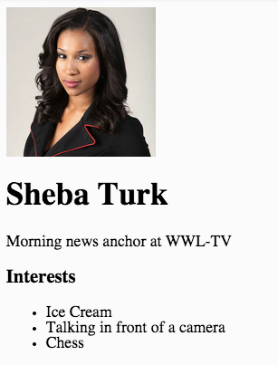

First Website
===

We're gonna go live on GitHub with your very own website!

**Table of Contents**

- [First Website](#first-website)
  - [Prerequisites](#prerequisites)
  - [Overview](#overview)
    - [Specs](#specs)
    - [Take Away](#take-away)
    - [Work Flow](#work-flow)
    - [Type of App](#type-of-app)
  - [Setup](#setup)
    - [Creating a New GitHub Repo For Your Site](#creating-a-new-github-repo-for-your-site)
    - [Creating a Cloud9 Workspace for our Website Project](#creating-a-cloud9-workspace-for-our-website-project)
  - [Lesson Steps](#lesson-steps)
    - [TODO 1 : Create index.html](#todo-1--create-indexhtml)
      - [The Big 3](#the-big-3)
      - [HTML in 3 Minutes](#html-in-3-minutes)
    - [TODO 2 : Add the DOCTYPE](#todo-2--add-the-doctype)
    - [TODO 3 : Add HTML Tags Required For a Webpage](#todo-3--add-html-tags-required-for-a-webpage)
    - [TODO 4 : Add a Title](#todo-4--add-a-title)
    - [TODO 5 : Create Sections for the Menu and Main Content](#todo-5--create-sections-for-the-menu-and-main-content)
    - [TODO 6 : Create Structure for our Content](#todo-6--create-structure-for-our-content)
    - [TODO 7 : Add Content](#todo-7--add-content)
  - [Serve Your Website](#serve-your-website)
  - [Serve Only the index page](#serve-only-the-index-page)
    - [TODO 8 : Add an Image and List](#todo-8--add-an-image-and-list)
    - [TODO 9 : Add More Content - Interests](#todo-9--add-more-content---interests)
    - [TODO 10 : Navigation and Site Title](#todo-10--navigation-and-site-title)
    - [TODO 11 : Make it Pretty](#todo-11--make-it-pretty)
      - [CSS Selectors in a Nutshell](#css-selectors-in-a-nutshell)
      - [Selecting HTML Elements by ID, Class, or by Tag Type](#selecting-html-elements-by-id-class-or-by-tag-type)
    - [TODO 12 : Play around with the CSS](#todo-12--play-around-with-the-css)
    - [Extra Credit](#extra-credit)
    - [TODO 13 : Add C9 to gitignore](#todo-13--add-c9-to-gitignore)
    - [TODO 14 : Go Live](#todo-14--go-live)

##Prerequisites

* [Students will require a GitHub account](https://github.com/join) and will need to remember their GitHub username and password.
* [Students will require a Cloud9 account - they will login to Cloud9 using their GitHub credentials](https://c9.io/web/login).
* Students should have basic knowledge of HTML and gone through the [Intro to HTML](https://github.com/OperationSpark/javascript-wiki/wiki/HTML-Intro) lesson.

##Overview

###Specs

* At the end of the lesson students will have built and designed their own website that is viewable on the web.
* The website will be hosted on GitHub under their own account, and is something they can build upon on over time. 
* The website will be the student's own and will feature a short profile of the student.

### Take Away

* Basic HTML5, including HTML (content) and CSS (style).
* Basic web page navigation
* Using git and GitHub

### Work Flow

You'll be creating a whole web page from scratch, from creating the `index.html` file, to writing all the `<html>` tags, adding content and style with CSS.  Because you're creating this page from scratch, there will be no TODO's to find in our code in this project.

To complete the assignment, below you'll find numbered **TODO** lesson steps.  While reading this lesson, whenever you come across a **TODO** step, you are expected to do this step, which may require you to create a file, or insert some HTML, CSS or JavaScript in the appropriate place. Please follow the instructions closely. Sometimes, however, we may be showing you code examples to make a point, so you only need to add code if we're explicitly telling you to do a lesson step, so please be aware of the actual lesson steps.  <a href="https://pages.github.com/" target="_blank">If you want to learn more about GitHub Pages, have a look here...</a>

### Type of App

We are building a website, to be viewed live on the web at your GitHub page, and it will be viewed in a web browser, like Chrome.

##Setup

###Creating a New GitHub Repo For Your Site

First things first, we need to create a new repository on GitHub, named using your GitHub username.

GitHub will host a website for each user and organization for free.  The feature is called <a href="https://pages.github.com/" target="_blank">GitHub Pages</a>.

Using this feature is actually really easy.  The first thing we need to do is create a repository on GitHub using the following naming pattern:

    yourusername.github.io
    
Follow these steps and see the screenshot to create a new repository, but NOTE: If you're not signed-in to GitHub, you might see a web page that says 404 (This is not the web page you are looking for).  Just sign-in to GitHub on this page and you will be forward to the _create new repository_ page.

<a href="https://github.com/new" target="_blank">Click here to open a new browser tab and create create a new GitHub repository</a>.
    
<ol style="list-style-type: upper-alpha;">
    <li>On the Create New Repository page, in the box for **Repository name**, name the repository like `your-github-username.github.io`, replacing `your-github-username` with you actual GitHub username.  MAKE SURE your username is spelled correctly, otherwise you'll have problems (See A).</li>
    <li>Enter a description for your repository in the **Description** box, like `My own awesome website!' (See B).</li>
    <li>Select the Public radio button to allow anyone to see this repository (See C).</li>
    <li>Check the "Initialize this repository with a README" box (See D).</li>
    <li>Click the "Add .gitignore" button, and select "Yeoman" from the dropdown.  Here, we're just selecting Yeoman because it gives us some default ignore patterns... we'll explain later (See E).</li>
    <li>Click "Create Repository" (See F).</li>
</ol>


Awesome, you created your repository!

###Creating a Cloud9 Workspace for our Website Project

Great, GitHub is where we store and version our code, but we need a place to edit our source code.  That's where Cloud9 comes in.  Cloud9 is web-based set of tools for creating software.  By working in the cloud, our projects workspace is independent from any one computer.  Plus, no matter what operating system you're using, Cloud9 gives us access to Linux, which is preferable for this course.

1.  Next step, we need to _clone_ our repository into our Cloud9 workspace, where we will do our work.  After creating the repository on GitHub, you'll be brought to the repository's default view.  In the bottom right corner of the screen, you will want to:
    
    A) Select SSH by clicking the blue text, SSH (See A).  PLEASE NOTE: THIS STEP IS IMPORTANT! Make sure you select SSH!
    
    B) Click the "Copy URL to clipboard" button (See B).
    
    

    Nice, you've copied the required URL to clone your repository into Cloud9, which is what we're gonna do next.

2. If you do not have Cloud9 open, open it now in a new browser tab.

3. We need to create a new Cloud9 workspace for our website project. Cloud9's interface has recently changed, so if you're using the new interface, you'll find the create-new-workspace button in the upper-right-side of the screen, like so:

    

    If you're using the older interface, find in the upper-left-corner and click the green button, "Create New Workspace" > "Clone From URL":

    

4. The next screen should be relatively the same for either old or new interface, though in the new interface, you may have to manually name your workspace, etc.  Either way, find the "Source URL" form input, copy and paste in the URL you copied from your GitHub repository (it should still be on your clipboard).
    
    Then, in the environment selection box, select "HTML5" (see B).  Finally, click the green button "Create" (see C).
    
    

5. Wait for the workspace to finish starting (while starting up, you'll see a spinning gear on the newly created workspace in the sidebar), and once the workspace is completed, click the green button, "START EDITING".

    

When the workspace loads, you'll see something like this:


Awesome, we're ready to create our website!

##Lesson Steps

### TODO 1 : Create index.html

Right-click in the file system and select `New File`


Name the file, `index.html`, (press return after naming it to save the new name) like so:


Next, double click the `index.html` file to open it so we can begin editing the file, like so:


Ok great!  We've created our `index.html` file and opened it in the text editor to start developing our website!

#### The Big 3

There's really three parts at play in a webpage:

* HTML: Hypertext Markup Language - A set of tags to mark or section-off the structure and content of a webpage.
* CSS: Cascading Style Sheets - A syntax for specifying a set of rules that _style_ web pages.  CSS is responsible for how a webpage looks!
* JavaScript: A programming language that allows web pages to respond to user input, to dynamically change the content or appearance of a webpage, or make request to load data into a webpage.  Essentially, JavaScript is responsible for the _behaviour_ of a webpage.

#### HTML in 3 Minutes

Very simply put, HTML is a set of text-tags that tell a web browser how to structure and identify the content of a web page. Developers _markup_ or _section off_ the structure and content of a webpage using HTML tags to _section off_ the parts of the page. Take a look at any webpage, and you'll see things like a header with some type of navigation, maybe a sidebar with more navigation options, and then headings, paragraph text, images and buttons.  All of these _page elements_ are marked as such using HTML tags.

Before we start marking-up our webpage, here's a few things to note about HTML Tags:

Try to remember that most HTML tags have both an opening and closing tag.  So, when you create a `<div>` tag, which stands for _document division_ (a way of sectioning off page content), you must also create its closing tag, like so:

```HTML
<div>
    <!-- All other tags and content in here belong to the <div></div> tag -->
</div>
```

Some HTML tags, like the `` tag, do not require a closing tag, because they are not designed to hold content between the opening and closing tag.  The image tag specifies the source of the image it should display using what's called a tag _attribute_, which is a property of the tag, not content of the tag.  Check it out:

```HTML

```

Notice, above, that the `src` attribute is located _inside_ the `` tag.

Also note that HTML tags are hierarchical, and **need to be indented to illustrate their hierarchical relationship!**  Tags can contain content, like text or images, but can also contain or _nest_ other tags. Have a look:

```HTML
<div id="content">
    <div id="sidebar">
        <!-- sidebar content goes here -->
    </div>
    <div id="main">
        <!-- main content goes here -->
    </div>
</div>
```

Above, you'll see this pattern often - notice that we have one `<div>` tag with an id attribute of `content`, and inside this tag, we have two other `<div>` tags, one for a sidebar and one for a main section of the page.  The _content_ `<div>` is the parent of both the _sidebar_ and _main_ `<div>`, while _sidebar_ and _main_ are siblings.  Notice the indentation - this is extremely as it clearly and visually spells out these hierarchical relationship.  Indentation and relationships of tags (and code blocks) are the things newcomers struggle with the most! Be vigilant here!

### TODO 2 : Add the DOCTYPE

You need to tell the browser you're writing an HTML page by adding the following at the top:

````HTML
<!DOCTYPE html>
````
### TODO 3 : Add HTML Tags Required For a Webpage

If you're not familiar with the basic tags needed for the structure of an HTML page, you'll want to memorize them:  Let's add our `<html>` tags with `<head>` and `<body>` tags nested within.

Like this: 

````HTML
<!DOCTYPE HTML>
<html>
    <head>
    </head>
    
    <body>
    </body>
</html>
````

At least for now, every HTML page contains the DOCTYPE, html, head and body tags.  The `<!DOCTYPE HTML>` tag tells the browser you want to render the document using the most recent version of HTML.  The opening and closing tags of `<html></html>` wrap our html page, but are in fact somewhat redundant.

The next two tag sets make up the two sections of any well formed HTML page: The `<head></head>` tag represents metadata for a webpage, that is, information about the web page used by the browser, providing extra information about the webpage, but is not content.  This is similar to the information on the outside of a postal envelope - the to and from address, the stamp, the processing stamp from the post office - information important to the delivery of the letter, but _nothing_ to do with the _content_ of the letter.

Finally, every page has a `<body></body>` tag, and it is between the body tag that all visible content will be placed.  That's right, all content you want to show to the user will be children of the `<body>`, so pay careful attention to ensure that when you're adding navigation, paragraphs and images tags, you're doing so within the `<body>` tag.

Ok then, we made the structure of the site so now we need some content! Give your site a title.

### TODO 4 : Add a Title

You should remember from our previous lessons on HTML5 that you create a title with the `<title>` tag inside of the `<head>`. This will add your title text to the browser tab.  Go ahead and do this now:

````
<title>Sheba's Amazing Website</title>
````

### TODO 5 : Create Sections for the Menu and Main Content

**Please note:** All of the tags used to mark our HTML content will reside _between_ the opening and closing of the `<body>` tag.  So for rest of the HTML tags you create, _make sure_ you place them _between_:

```HTML
<body>
    <!-- YOUR HTML TAGS GO HERE  -->
</body>
```

We're going to create `<div>` tags to group our content together.  The `<div>` tag stand for _document division_, and they are special tags that help us divide or group together content on our web page.  You can consider them sort of like containers, into which we group content, and those containers can be invisible or _styled_ with visible properties, like a background color, a border, etc.

Go ahead and add the following structure, so that your `<body>` looks like this:

```HTML
    <body>
        <div id="all-contents"> 
            <nav>
            </nav>
            
            <main>
            </main>
        </div>
    </body>
```

So, to start grouping together our content in a meaningful way, inside the `<body>` tag, we created a new document division using the `<div>` tag.  This is going to contain all the site content so we annotated it as such by setting its _id_ attribute to `id="all-contents"`.  Attributes are properties that tell us something more specialized about the tag, and you'll come to understand how these work as you work more with HTML.

In particular, the `id` attribute allows us to _uniquely_ identify an HTML element in our webpage. Technically speaking, when giving an id to an element, this id _should be_ unique within the page - no two elements should share the same id in the same webpage, and this is an important distinction.

Finally, inside our _all-contents_ div, we're going to put the site navigation menu and the main content of our site, so we created opening and closing tags for `<nav>` and `<main>`.

### TODO 6 : Create Structure for our Content

Inside the `<main>` element, create two new `<div>` elements. These will act as the two columns of our page - the sidebar and the main content, as noted by the class we give each:

```HTML
            <main>
                <div class="sidebar">
                </div>
    
                <div class="content">
                </div>
            </main>
```

Ok, so far, we've sectioned of our webpage, now we need to add some content...

### TODO 7 : Add Content

Add the following tags inside of the `<div class="content">` tag:

* Create a `<header>` element and put your name inside of it.
* Below that make a `<p>` element and inside it put your position or job title such as "Student at XYZ High."

## Serve Your Website

It's now time to serve your website like a pro, so we can preview it as if looking at it live on the web, only, we won't be _live_ yet, we'll be serving from our Cloud9 workspace.  The public won't really be able to see it yet, not really - we'll push our website live to GitHub in a later step so the public can see it, but for now, we're serving in development mode.

With the index.html tab selected in the editor (see A), you can simply press the green `Run` button (see B).

This will start an Apache web server in a new tab of the Console View, the bottom window pane of the Cloud9 IDE. Once Apache has booted, you can click the URL `https://myusername-github-io-myusername.c9.io/index.html (see C) - this will open a new tab with the appliation running.


Once this tab opens, we recommend popping out the tab into Chrome, into a separate browser tab. To do so, click on the popout button on the right side of the preview tab (see A), like so:


This will give you the website running in a separate Chrome browser tab, like this:


You'll notice above, we have two tabs open in Chrome now - one running your website (the tab that current has focus), and the other tab, (the one with the blue Cloud9 icon) is your Cloud9 workspace.  So to continue working, switch to your workspace tab, code a little, save your changes, then switch back to the website tab, and refresh.

As you save your future work, changes to your code will be reflected in your website - **you don't have to press "Run" again, and shouldn't** - as long as the Apache web server is still running - you need only to switch back to the tab running your website, and only press the refresh button on the Chrome tab with the  running in it.  

## Serve Only the index Page

Be careful not to open too many processes in Cloud9.  Cloud9 is a powerful set of tools, and it's easy to feel a little overwhelmed by all the menus and buttons. We want you to start using industrial tools, and it will benefit you to watch some YouTube videos on "getting started with Cloud9" to learn more about how to use Cloud9.

For our purposes, and in the short term, you need only follow the above steps to serve the index.html file of your website, once.  Doing so will open up a process in its own tab in the Console View.  This process is an Apache web server that is serving up your `index.html`.

`index.html` is the default web page returned when we ask a web browser to fetch a URL that does not explicit request a particular file. So a URL like "www.google.com" will fetch "www.google.com/index.html".

Again, once your Apache webserver is running and serving up your `index.html` file, your Console View should include only a maximum of three tabs, your **bash terminal**, perhaps an **immediate JavaScript** tab, and **Apache** serving up your `index.html` file.  In other words, the Console View should look like this:


Sometimes, while students are working in other files, they might accidentally press Run again, and Cloud9 will start another process, run another instance of an Apache web server, and serve that file.  This is unnecessary, and undesirable. You should only need to be running one web server, that is, one instance of Apache serving your index.html file.

If you find yourself with more than 3 tabs open, stop the extra processes by selecting their tab, pressing the red `Stop` button, then click the `x` to close the unnecessary tab.  Here's a shot of too many files being served:


Above, you're serving both the index.html file in tab 3 _and_ serving the portfolio.html file in tab 4.  Here, you'd want to stop serving in tab 4, and close it.

You need only serve index.html - from there, you can get to any part of your website.

Finally, if for some reason your Apache web server stops, which might happen if you do not revisit your workspace for several days, you need only press the green Run button on the Console View tab where Apache has stopped, like so:


In the above image, notice the tab says "index.html - Idle" - this means the process, Apache is idle and not running.  So here, you'd just press the green Run button to restart your Apache server.

Don't worry if this feels very new to you - it is, but you'll get use to it.

### TODO 8 : Add an Image and List 

* Inside of the `<div class="sidebar">` tag, add an `` tag. More on image tags [here](http://www.w3schools.com/tags/tag_img.asp).
* We need to add the URL of an actual image with the **src** attribute. Find an image you would like on your page, you can find an image of yourself from Facebook, or anything else using a Google image search. Right-click on the image, and choose 'Copy Image URL.'
* Paste that URL into the **src** attribute. 

So, your full image tag should look this this:


````HTML
                <div class="sidebar">

                    
                </div>
````

Save your page and preview it. You should see the image now. If you don't, go back and double check that there are no
errors in your `` tag.

### TODO 9 : Add More Content - Interests

Let's create a section for your interests below the `<p>` tag (inside of the '[class=content]' div) with a list.

* Create a section element with a `class="interests"`
* Give the list a title with the `<header>` tag and called it 'Interests'
* Below that create an unordered list with the `<ul>` tag and three sets of `<li>` tags nested inside

````HTML
                    <section class="interests">
                        <header>Interests</header>
                        <ul>
                            <li>Thing 1</li>
                            <li>Thing 2</li>
                            <li>Thing 3</li>
                        </ul>
                    </section>
````

Use your own interests! Save and view your changes.

Should look something like this:



### TODO 10 : Navigation and Site Title

We're going to make a menu. Linking to other pages forms the foundation of the web. Early on, the web was nothing but a bunch of HTML pages linked to one another. That's still true today although there's a lot more going on as well. We're going to link to a portfolio page and create it in the next lesson.

* Inside of the `<nav>` tag we created earlier create an unordered list using the `<ul>` tag. Inside it create two `<li>` tags to contain your list items
* Create a link inside of each list item using the `<a>` tag. 
* Finally give each menu item a name by inserting Home and Portfolio between the opening and closing tags.  See the example below.

````HTML
            <nav>
                <ul>
                    <li><a href="index.html">Home</a></li>
                    <li><a href="portfolio.html">Portfolio</a></li>
                </ul>
            </nav>
````

Save and view your work. You now have some menu items! The *Home* link even works since it simply links to the page we are currently working on. The other link is for our portfolio page which we'll build out in the next lesson.

Your site needs a title! Inside of the `<nav>` before the `<ul>` tag add an `<header>` and type your site's title in there.

Like this:

````HTML
            <nav>
                <header>Sheba's Glorious Website</header>
                <ul>
                    <li><a href="index.html">Home</a></li>
                    <li><a href="portfolio.html">Portfolio</a></li>
                </ul>
            </nav>
````

Save and view your work. You should see your title inside of the navbar to the left. 

### TODO 11 : Make it Pretty

We now have a fairly plain website but it's a website! Let's add some style.  Here's where CSS comes in!

Copy the entire below section and place it inside the `<head>` below the `<title>` tag.

````CSS
        <style>
            body {
                background: rgb(125, 198, 205);
                color: rgb(45, 45, 45);
                padding: 10px;
                font-family: arial;
            }
            header {
                font-size: 1.5em;
                font-weight: bold;
            }
            [id=all-contents] {
                max-width: 800px;
                margin: auto;
            }
    
            /* navigation menu */
            nav {
                background: rgb(239, 80, 41);
                margin: 0 auto;
                display: flex;
                padding: 10px;
            }
            nav header {
                display: flex;
                align-items: center;
                color: rgb(255, 255, 255);
                flex: 1;
            }
            nav ul {
                list-style-image: none;
            }
            nav li {
                display: inline-block;
                padding: 0 10px;
            }
            nav a {
                text-decoration: none;
                color: #fff;
            }
    
            /* main container area beneath menu */
            main {
                background: rgb(245, 238, 219);
                display: flex;
            }
            [class=sidebar] {
                margin-right: 25px;
                padding: 10px;
            }
            [class=sidebar] img {
                width: 200px;
            }
            [class=content] {
                flex: 1;
                padding: 15px;
            }
            [class=interests] header {
                font-size: 1.25em;
            }
        </style>
````

Ok, we've pasted-in a bunch of style rules between the `<style></style>` tag, and if we save your work and reload your website, you should see that your page is now styled with some colors and some positioning.

#### CSS Selectors in a Nutshell

CSS allows us to specify styling rules for our HTML elements.  When we say _elements_, we're talking about all the HTML tags within a webpage.  In best practice, we separate the content of an HTML document from the style or presentation of the content.  This allows us to change appearence without modifying content, allows styles to be better managed across multiple pages, and creates a cleaner code base.

In order to style HTML elements, we need a way to _select_ the elements.

#### Selecting HTML Elements by ID, Class, or by Tag Type

When we create HTML elements, we can assign them an id or a class. In our HTML so far, we've given one element an id of _all-contents_ and another a class of _sidebar_. We did this by using the id and class attributes of the `<div>`. For example:

````HTML
<div id="all-contents">
    <div class="sidebar"></div>
</div>
````
By more concretely describing HTML elements by id or class, we can then select those elements by their id or class, and style them the way we like, and for this reason, the rules we specify in CSS are called _selectors_. We can also select elements by their tag type, as in, `body`, `p`, `h1`, `nav`.

Selectors and their styling rules tell the web browser which elements to select, and how to style them.  In a moment, we are going to add some more style to our `<nav>` element, and by doing so using the `nav` selector, we are creating a style rule that will be applied to _all nav tags_ on our webpage.

Selecting an element by id should only return one element, if your web page is well formed, so applying a style rule by id should only style one element on the page.

Selecting an element by its tag type or by its class will style all tags of that type, or all tags of that class.

Finally, in our CSS, we've also shown you two ways to specify selectors, the long form, which is more explicit, and the short form. This is the long form of for an id selector:

````CSS
[id=all-contents] {
    max-width: 800px;
    margin: auto;
}
````

However, the same selector can be spelled using the number symbol `#`, for id, like this:

````CSS
#all-contents {
    max-width: 800px;
    margin: auto;
}
````

The short form to specify a CSS selector by class is the dot `.`, as in:

````CSS
.sidebar {
    margin-right: 25px;
    padding: 10px;
}
````

The long form of sidebar class selector is:

````CSS
[class=sidebar] {
    margin-right: 25px;
    padding: 10px;
}
````

|Type  | Long form                      | Short form            | 
|------| ------------------------------ |-----------------------|
|class | [class=all-contents] { ... }   | .all-contents { ... } |
|id    | [id=portfolio] { ... }         | #portfolio { ... }    |


### TODO 12 : Play around with the CSS

Check it out! We have some style but not much and some elements are too close together. Let's fix that.

Find the `nav` CSS selector within the `<style>` you just pasted in place, it looks like this:

````CSS
nav {
        background: rgb(239, 80, 41);
        margin: 0 auto;
        display: flex;
        padding: 10px;
    }
````

* Under the style rule: `margin: 0 auto;` add `margin-bottom: 20px;`
* Save and view the changes. The menu now has some space underneath it!
* Do you like these colors? Remember that all colors can be represented as a combination of red, green, and blue numbers 0-255. See the `rgb(...)` functions above? Play around with the values in the `rgb(...)` function calls to use your own colors.


### Extra Credit

* Google `border-radius` and add it to the `<nav>` element.
* Add a border around the image

### TODO 13 : Add C9 to gitignore

We need to do some cleanup before putting your site onto the internet. This step will make working with our site easier in the future by making our site ignore files generated by Cloud 9 that we don't need.

* Click on the _gear_ icon at the top left above the project folders and select "Show Hidden Files."
* At the bottom of the `.gitignore` file, on a blank line add `.c9`
* Save the `.gitignore` file, and close it.  We've asked git to ignore the Cloud9 IDE configuration files - there's no need for us to manage these in our git version control.

### TODO 14 : Go Live

Let's put our site on the Internet so that anyone can look at it!

With <a href="https://pages.github.com/" target="_blank">GitHub Pages</a>, once you push your changes from your Cloud9 workspace up to your GitHub repository, your page will be live on the Internet.

To do so, you'll need to enter the following git commands into your bash terminal.  Select the bash terminal in the Console View - the bottom window pane in Cloud9.

Enter the following commands, and be careful to place your spaces correctly and press `ENTER` after each one. Read the results of each command and check for errors.

First, add all the files we worked into git so that they can be archived in our source control

`git add -A`

Then archive everything that has been added

`git commit -m 'A basic website'`

Finally, sync the repository in cloud9 with the one on github. Type 'yes' when prompted.

`git push`

You just sent your code to github where it will be backed up and made into a website anyone can see. You should be able to see your code should now appear on the github page from the Setup step above.

Give it a couple minutes and you should be able to view your website live on the web at http://username.github.io! (Where 'username' is your own GitHub username.)

Congratulations!  You are LIVE ON THE INTERNET!
